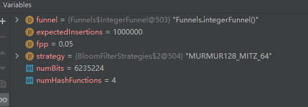

## 什么是布隆过滤器
直观的说，bloom算法类似一个hash set，用来判断某个元素（key）是否在某个集合中。
和一般的hash set不同的是，这个算法无需存储key的值，对于每个key，只需要k个比特位，每个存储一个标志，用来判断key是否在集合中。

算法：
1. 首先需要k个hash函数，每个函数可以把key散列成为1个整数
2. 初始化时，需要一个长度为n比特的数组，每个比特位初始化为0
3. 某个key加入集合时，用k个hash函数计算出k个散列值，并把数组中对应的比特位置为1
4. 判断某个key是否在集合时，用k个hash函数计算出k个散列值，并查询数组中对应的比特位，如果所有的比特位都是1，认为在集合中。

优点：不需要存储key，节省空间
缺点：删除非常麻烦
## google布隆过滤器源码分析

以google的布隆过滤器为例，设置容量为100w，误差0.01。需要7个hash函数，本地占用的内存约960wbits。
100w个int直接占用的内存有400万byte，3200万bit。大大节省了空间。

误差设置为0.05后，hash函数只需要4个，内存也更小了。

在实际中，也需要设置合适的准确率，提高效率和空间利用率。

## Google布隆过滤器与Redis布隆过滤器对比
Google布隆过滤器的缺点
基于JVM内存的一种布隆过滤器重启即失效。本地内存无法用。在分布式场景不支持大数据量存储

Redis布隆过滤器
可扩展性Bloom过滤器：一旦Bloom过滤器达到容量，就会在其上创建一个新的过滤器不存在重启即失效或者定时任务维护的成本：基于Google实现的布隆过滤器需要启动之后初始化布隆过滤器缺点：需要网络IO，性能比Google布隆过滤器低

## 布隆过滤器的优化-布谷鸟过滤器（补充）
布谷鸟过滤器是理论上布隆过滤器的一种优化。相比布谷鸟过滤器而言布隆过滤器有以下不足：查询性能弱、空间利用效率低、不支持反向操作（删除）以及不支持计数。

布谷鸟过滤器源于布谷鸟Hash算法，布谷鸟Hash表有两张，分别两个Hash函数，当有新的数据插入的时候，它会计算出这个数据在两张表中对应的两个位置，这个数据一定会被存在这两个位置之一（表1或表2）。一旦发现其中一张表的位置被占，就将改位置原来的数据踢出，被踢出的数据就去另一张表找对应的位置。通过不断的踢出数据，最终所有数据都找到了自己的归宿。
但仍会有数据不断的踢出，最终形成循环，总有一个数据一直没办法找到落脚的位置，这代表布谷Hash表走到了极限，需要将Hash算法优化或Hash表扩容。

布谷鸟过滤器只会存储元素的指纹信息（几个bit，类似于布隆过滤器），由于不是存储了数据的全部信息，会有误判的可能。

在错误率3%以下的情况，布谷鸟过滤器空间优于布隆过滤器。

布谷鸟过滤器的改进
* 增加 hash 函数，让每个元素不止有两个巢，而是三个巢、四个巢。这样可以大大降低碰撞的概率，将空间利用率提高到 95%左右。

* 在数组的每个位置上挂上多个座位，这样即使两个元素被 hash 在了同一个位置，也不必立即「鸠占鹊巢」，因为这里有多个座位，你可以随意坐一个。除非这多个座位都被占了，才需要进行挤兑。

布谷鸟过滤器的明显缺点：
* 如果想要让布谷鸟过滤器支持删除操作，那么就必须不能允许插入操作多次插入同一个元素，确保每一个元素不会被插入多次（kb+1）。这里的 k 是指 hash 函数的个数 ，b 是指单个位置上的座位数。
* 在现实世界的应用中，确保一个元素不被插入指定的次数那几乎是不可能做到的。

