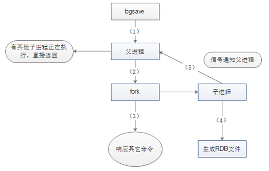
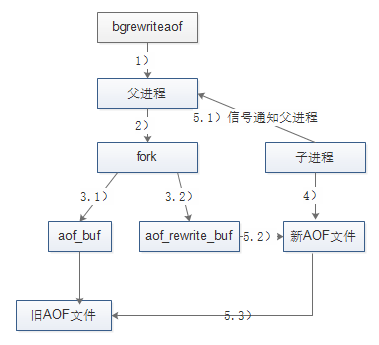
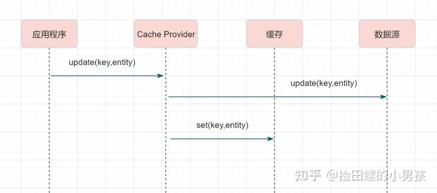
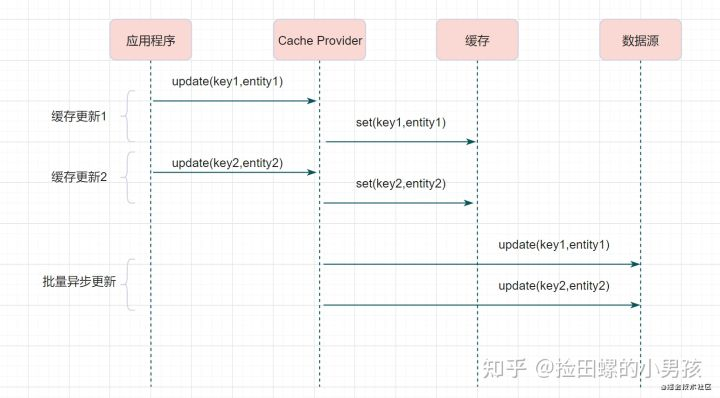
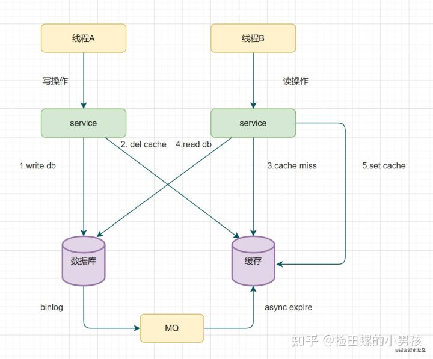

# Nosql四大分类
* KV键值对
    * 新浪 ：Redis
    * 美团 ：Redis + Tair
    * 阿里、百度 ：Redis + memecache
* 文档型数据库（bson格式，类似json）
    * **MongoDB** 
        * MongoDB是一个基于分布式文件存储的数据库，C++编写，处理大量数据文档。
        * MongoDB是一个介于关系型数据库与非关系型数据库中间的产品。是非关系型数据库中功能最多，最像关系型数据库的。
    * ConthDB
* 列存储数据库
    * HBase
    * 分布式文件系统
* 图关系数据库
    * 存放拓扑关系，如Neo4j，InfoGrid

# Redis概述
* Redis（Remote Dictionary Server )，即远程字典服务。官方表示有100000+的QPS（每秒查询效率）
* Redis可以做到 ： 内存存储，持久化（rdb，aof），发布订阅系统，地图信息分析，计时器，计数器。。。
* 特性 ：数据多样，持久化，集群，事务
* Redis为单线程（核心模块）（网络I/O已经有多线程）
  * Redis是基于内存操作的，cpu不是他的性能瓶颈。
  * Redis的瓶颈是内存大小和网络带宽。
    
## Q：Redis为什么单线程还这么快
* 多线程由于CPU上下文切换，不一定比单线程效率高。
* Redis将所有数据都放在内存中，所以单线程操作速度很快。
* 高效数据结构。  
* 合理的数据编码。  
* I/O使用多路复用技术。Redis使用的是非阻塞IO，IO多路复用，使用了单线程来轮询描述符，将数据库的开、关、读、写都转换成了事件，减少了线程切换时上下文的切换和竞争。
  * 什么是I/O多路复用？
  * 哪种I/O多路复用？  
* redis6.0之前使用的是是用loop线程读取epoll 返回，然后逐一执行crud 这样做，读取客户端数据跟服务器增删改查都在一起，缺点就是并发可能存在瓶颈。
* redis6.0之后也是使用了多线程技术。worker主线程负责数据的计算。IO子线程负责网络数据的读写和协议解析。执行命令依然是单线程顺序执行。
    * Redis6.0的多线程部分只是用来处理网络数据的读写和协议解析，执行命令仍然是单线程顺序执行。

* Redis的高并发能力，主要看它的网络模型，单线程的redis是不如多线程的memecache的。

### Q：什么是I/O多路复用，redis用了哪种I/O多路复用
单个线程，通过记录跟踪每个I/O流(sock)的状态，来同时管理多个I/O流 。这就是I/O多路复用

select, poll, epoll 都是I/O多路复用的具体的实现，在redis中，我们使用的是epoll

## Q : 说一下 Redis 和 Memcached 的区别和共同点
共同点 ： 
* 都是基于内存的数据库，一般都用来当做缓存使用。
* 都有过期策略。
* 两者的性能都非常高

不同点 ： 
* **Redis 支持更丰富的数据类型**（支持更复杂的应用场景）。Memcached 只支持最简单的 k/v 数据类型。Redis还提供 list，set，zset，hash 等数据结构的存储。
* **Redis 支持数据的持久化**，可以将内存中的数据保持在磁盘中，重启的时候可以再次加载进行使用,而 Memecache 把数据全部存在内存之中。
* Redis 有灾难恢复机制。 因为可以把缓存中的数据持久化到磁盘上。
* Memcached 是多线程，非阻塞 IO 复用的网络模型；**Redis 使用单线程的多路 IO 复用模型。** （Redis 6.0 引入了多线程 IO ）
* **Redis 支持发布订阅模型、Lua 脚本、事务等功能**，而 Memcached 不支持。并且，Redis 支持更多的编程语言。
* Memcached过期数据的删除策略只用了惰性删除，而 Redis 同时使用了惰性删除与定期删除。

## redis过期策略（巡查）
Redis采用的是定期删除 + 懒惰删除策略。

定期删除策略：

Redis 会将每个设置了过期时间的 key 放入到一个独立的字典中，默认每 100ms 进行一次过期扫描：
1. 随机抽取 20 个 key
2. 删除这 20 个key中过期的key
3. 如果过期的 key 比例超过 1/4，就重复步骤 1，继续删除。

定期删除可能会导致很多过期 key 到了时间并没有被删除掉，就会用到惰性删除了。

* 在你获取某个 key 的时候，redis 会检查一下 ，这个 key 如果设置了过期时间那么是否过期了？如果过期了此时就会删除，不会给你返回任何东西。

但是这样还有问题，定期删除漏掉了很多过期 key，然后也没及时去查，也就没走惰性删除，就会导致大量的key积压在内存，此时需要内存淘汰策略。

|  淘汰策略     |     作用             |
|------------ | --------------------|
| no-eviction |当内存不足以容纳新写入数据时，新写入操作会报错，无法写入新数据，一般不采用。|
|allkeys-lru  |当内存不足以容纳新写入数据时，移除最近最少使用的key，这个是最常用的|
|allkeys-random|当内存不足以容纳新写入的数据时，随机移除key|
|allkeys-lfu |当内存不足以容纳新写入数据时，移除最不经常（最少）使用的key|
|volatile-lru |当内存不足以容纳新写入数据时，在设置了过期时间的key中，移除最近最少使用的key。|
|volatile-random|内存不足以容纳新写入数据时，在设置了过期时间的key中，随机移除某个key |
|volatile-lfu|当内存不足以容纳新写入数据时，在设置了过期时间的key中，移除最不经常（最少）使用的key|
|volatile-ttl|当内存不足以容纳新写入数据时，在设置了过期时间的key中，优先移除过期时间最早（剩余存活时间最短）的key。|

这里注意LRU和LFU

LFU：

Redis 4.0 里引入了一个新的淘汰策略 —— LFU（Least Frequently Used） 模式，作者认为它比 LRU 更加优秀。

LFU 表示按最近的访问频率进行淘汰，它比 LRU 更加精准地表示了一个 key 被访问的热度。

如果一个 key 长时间不被访问，只是刚刚偶然被用户访问了一下，那么在使用 LRU 算法下它是不容易被淘汰的，因为 LRU 算法认为当前这个 key 是很热的。而 LFU 是需要追踪最近一段时间的访问频率，

# Redis数据类型
Redis有五大数据类型 ：
* String
  * 使用最多。一般常用在需要计数的场景，比如用户的访问次数、热点文章的点赞转发数量等等。
* List
  * 发布与订阅或者说消息队列、慢查询。
* Set
  * 需要存放的数据不能重复以及需要获取多个数据源交集和并集等场景
* Hash
  * 系统中对象数据的存储。
* Zset
  * 需要对数据根据某个权重进行排序的场景。比如在直播系统中，实时排行信息包含直播间在线用户列表，各种礼物排行榜，弹幕消息（可以理解为按消息维度的消息排行榜）等信息。
   
三种特殊的数据类型 : 
* geospatial 地理位置
* Hyperloglog 基数统计
* Bitmap 位图场景 

# Redis事务

Redis事务**没有隔离级别**的概念，也不支持roll back。        
Redis单条命令保证原子性，但是**Redis事务不保证原子性**。         
Redis事务顺序：
* 开启事务 （multi）
* 命令入队 （....）
* 执行事务 （exec）

如果Redis事务中有一条命令语法错误，那只有那一条不执行，其他仍会执行。

悲观锁 ： 
* 什么时候都可能出问题，所以任何操作都加锁。 

乐观锁 ：
* 不上锁，更新数据时去判断一下，在此期间是否有人修改过这个数据。
* 开始时获取version，更新时比较version。（Mybaits）

Redis使用乐观锁。 Redis使用watch监控。watch充当乐观锁。（可用于秒杀）。

# RDB持久化

> RDB持久化是指在指定的时间间隔内将内存中的数据集快照写入磁盘。也是默认的持久化方式，这种方式是就是将内存中数据以快照的方式写入到二进制文件中,默认的文件名为dump.rdb。

## RDB持久化流程

具体流程 ：
1. Redis父进程首先判断：当前是否在执行save，或bgsave的子进程，如果在执行则bgsave命令直接返回。
2. 父进程执行fork操作创建子进程，这个过程中父进程是阻塞的，Redis不能执行来自客户端的任何命令
3. bgsave命令返回”Background saving started”信息并不再阻塞父进程，并可以响应其他命令
4. 子进程创建RDB文件，根据父进程内存快照生成临时快照文件，完成后对原有文件进行原子替换
5. 子进程发送信号给父进程表示完成，父进程更新统计信息

## 触发持久化
可以手动触发与自动触发。

### 手动触发
手动使用save命令和bgsave命令都可以生成RDB文件.      
* save ：save命令会阻塞Redis服务器进程，直到RDB文件创建完毕为止，在Redis服务器阻塞期间，服务器不能处理任何命令请求。
* bgsave命令会创建一个子进程，由子进程来负责创建RDB文件，父进程(即Redis主进程)则继续处理请求。

所以save命令现在已基本不使用。

### 自动触发
* 自动触发最常见的情况是在配置文件中通过save m n，指定当m秒内发生n次变化时，会触发bgsave。
  * Redis的save m n，是通过serverCron**周期函数**、dirty**计数器**、和lastsave**时间戳**来实现的。
    * serverCron是Redis服务器的周期性操作函数，默认每隔100ms执行一次；该函数对服务器的状态进行维护，其中一项工作就是检查 save m n 配置的条件是否满足。
    * dirty计数器是Redis服务器维持的一个状态，记录了上一次执行bgsave/save命令后，服务器状态进行了多少次修改(包括增删改)；而当save/bgsave执行完成后，会将dirty重新置为0。
    * astsave时间戳也是Redis服务器维持的一个状态，记录的是上一次成功执行save/bgsave的时间。  
* 在主从复制场景下，如果从节点执行全量复制操作，则主节点会执行bgsave命令，并将rdb文件发送给从节点
* 执行shutdown命令时，自动执行rdb持久化，如下图所示：

RDB优点：
* 适合大规模数据恢复。
* 对数据的完整性要求不高。  
* redis默认使用RDB持久化，比较高效。

RDB缺点：
* 需要一定的时间操作。
* fork进程会占用一定的内存空间。

# AOF（Append Only File）持久化 

> AOF持久化(即Append Only File持久化)，则是将Redis执行的每次写命令记录到单独的日志文件中（有点像MySQL的binlog）；当Redis重启时再次执行AOF文件中的命令来恢复数据。

## 重写

如果文件超过64m，就会触发重写机制

AOF优点：
* 每一次修改都同步，文件完整性好
* 默认每秒同步一次，可能会丢失一秒的数据
* 从不同步，效率最高

AOF缺点：
* 文件大
* 恢复速度慢
* 性能影响大

## 持久化补充
1. 持久化在Redis高可用中的作用：数据备份，与主从复制相比强调的是由内存到硬盘的备份。
2. RDB持久化：将数据快照备份到硬盘；介绍了其触发条件（包括手动出发和自动触发）、执行流程、RDB文件等，特别需要注意的是文件保存操作由fork出的子进程来进行。
3. AOF持久化：将执行的写命令备份到硬盘（类似于MySQL的binlog），介绍了其开启方法、执行流程等，特别需要注意的是文件同步策略的选择（everysec）、文件重写的流程。
4. 一些现实的问题：包括如何选择持久化策略，以及需要注意的fork阻塞(cpu阻塞)、AOF追加阻塞（硬盘阻塞）等。

# 主从复制
主从复制，是指将一台redis服务器的数据，复制到其他redis服务器。前者成为主节点，后者从节点。

数据复制是单向的，只能由主节点到从节点

主节点以写为主，从节点以读为主（读写分离）

## 主从复制的作用
1. 数据冗余：主从复制实现了数据的热备份，是持久化之外的以中冗余方式。
2. 故障恢复：主节点出现问题时，可以由从节点提供服务，快速故障恢复。
3. 复杂均衡：主从复制基础上，读写分离，尤其是写少读多的情况下，分担服务器负载，提高性能。
4. 高可用(集群)基石：主从复制还是**哨兵模式**和集群能够实施的基础。

一般来说，工程中一台redis不可能，原因：
1. 从结构中，单个服务器会发生单点故障，且负载压力大。
2. 从容量上，单个redis服务器内存容量有限。

## 主从复制原理
1. 从机成功连接到主机（master）后，发送一个sync同步命令
2. master接到后，启动后台存盘。完成后，master会将整个数据发给从机，并完成一次同步
    * 全量复制： 从机接受到数据后，将其存盘并加载到内存。
    * 增量复制： master继续将新的收集到的修改命令依次传给从机，完成同步。

只要重新连接到主机，就会执行一次全量复制。

## 哨兵模式
当主服务器宕机后，需要手动把一台服务器切换为主服务器。费事费力，且一段时间内服务器不可用。我们这时采用哨兵模式解决整个问题。          
哨兵模式是一种特殊的模式。       
* 哨兵是一个独立的进程，哨兵通过发送命令，等待redis服务器响应，从而监控多个redis实例。
* 当哨兵监测到master宕机，会自动将slave切换成master，然后通过发布订阅模式通知其他的从服务器，修改配置文件，让它们切换主机。

用文字描述一下故障切换（failover）的过程。假设主服务器宕机，哨兵1先检测到这个结果，系统并不会马上进行failover过程，仅仅是哨兵1主观的认为主服务器不可用，这个现象成为主观下线。当后面的哨兵也检测到主服务器不可用，并且数量达到一定值时，那么哨兵之间就会进行一次投票，投票的结果由一个哨兵发起，进行failover操作。切换成功后，就会通过发布订阅模式，让各个哨兵把自己监控的从服务器实现切换主机，这个过程称为客观下线。这样对于客户端而言，一切都是透明的。

# Redis缓存穿透，击穿与雪崩（重点）
服务器的高可用问题。

## 缓存穿透（查不到）

用户查询一个数据，redis内存内没有（缓存没命中），就向持久层数据库查询，也没有，一次查询失败。当客户很多时，缓存都没命中，会给持久层数据库带来巨大压力，出现缓存穿透。

解决方案 ： 
1. **布隆过滤器** ： 给缓存加一个过滤器
   * 布隆过滤器是一种数据结构，对所有可能查询的参数以hash形式存储，现在控制层校验，不符合则丢弃，避免了对持久层数据库的查询压力。
2. 缓存空对象 ： 存储层不命中后，返回一个**加入过期时间的空对象**并将其加入缓存。
   * 空值被缓存就以为中缓存需要更多的空间。
   * 即使对空值设置了过期时间，还是会存在缓存层与存储层数据不一致的一段时间，对业务一致性有影响。
    
## 缓存击穿（查太多）

缓存击穿，是指一个key非常热点，超大并发集中对这一个点访问。当这个key失效的时候，大并发直接请求数据库，使数据库瞬间压力过大。

解决方案：
1. 设置热点数据不过期。
2. 加互斥锁（分布式锁）： 
    * 分布式锁 ： 对于每个key同时只有一个线程去查询后端服务。其他线程没有分布式锁的权限，只能等待。这个方法将高并发的压力转移到分布式锁，对锁要求高。
    
## 缓存雪崩
指在一个时间段，缓存集中过期失效，redis宕机。比如双十一0点一波抢购集中加入缓存，然后1点缓存集中过期。此时的访问直接到达数据库。

解决方案 ：
1. redis高可用 ： 多搭几台redis，就是搭建集群（异地多活）
2. 限流降级 ： 缓存失效后，通过加锁或是队列控制读数据库与写缓存的线程数。
3. 数据预热 ： 正式部署前，预先访问数据，让缓存失效的时间尽量均匀。

## redis与Mysql一致性
有三种经典的缓存模式：
1. Cache-Aside Pattern
2. Read-Through/Write through
3. Write behind

### Cache-Aside Pattern
Cache-Aside读流程：
1. 读的时候，先读缓存，缓存命中的话，直接返回数据
2. 缓存没有命中的话，就去读数据库，从数据库取出数据，放入缓存后，同时返回响应。

Cache-Aside 写流程：
更新的时候，先更新数据库，然后再删除缓存。

### Read-Through/Write-Through（读写穿透）
Read/Write Through模式中，服务端把缓存作为主要数据存储。应用程序跟数据库缓存交互，都是通过抽象缓存层完成的。

Read-Through读流程：
1. 从缓存读取数据，读到直接返回
2. 如果读取不到的话，从数据库加载，写入缓存后，再返回响应。

Write-Through写流程：

Write-Through下所有的写操作都经过缓存，每次我们向缓存中写数据的时候，缓存会把数据持久化到对应的数据库中去，且这两个操作都在一个事务中完成。因此，只有两次都写成功了才是最终写成功了。

### Write behind （异步缓存写入）

Write behind跟Read-Through/Write-Through有相似的地方，都是由Cache Provider来负责缓存和数据库的读写。它两又有个很大的不同：Read/Write Through是同步更新缓存和数据的，Write Behind则是只更新缓存，不直接更新数据库，通过批量异步的方式来更新数据库。

这种方式下，缓存和数据库的一致性不强，对一致性要求高的系统要谨慎使用。但是它适合频繁写的场景，MySQL的InnoDB Buffer Pool机制就使用到这种模式。

## 为什么删除缓存而不是更新缓存
1. 线程A先发起一个写操作，第一步先更新数据库
2. 线程B再发起一个写操作，第二步更新了数据库
3. 由于网络等原因，线程B先更新了缓存
4. 线程A更新缓存。

这时候，缓存保存的是A的数据（老数据），数据库保存的是B的数据（新数据），数据不一致了，脏数据出现啦。如果是删除缓存取代更新缓存则不会出现这个脏数据问题。

## 双写的情况下，为什么先操作数据库
Cache-Aside缓存模式中，在写入请求的时候，是先操作数据库。

1. 线程A发起一个写操作，第一步del cache
2. 此时线程B发起一个读操作，cache miss
3. 线程B继续读DB，读出来一个老数据
4. 然后线程B把老数据设置入cache
5. 线程A写入DB最新的数据

缓存和数据库的数据不一致了。缓存保存的是老数据，数据库保存的是新数据。因此，Cache-Aside缓存模式，选择了先操作数据库而不是先操作缓存。

## 延时双删策略
1. 先删除缓存；
2. 再写数据库；
3. 休眠500毫秒（根据具体的业务时间来定）；
4. 再次删除缓存。

结合双删策略+缓存超时设置，这样最差的情况就是在超时时间内数据存在不一致，而且又增加了写请求的耗时。

## 删除缓存重试机制
不管是延时双删还是Cache-Aside的先操作数据库再删除缓存，如果第二步的删除缓存失败呢，删除失败会导致脏数据

1. 写请求更新数据库
2. 缓存因为某些原因，删除失败
3. 把删除失败的key放到消息队列
4. 消费消息队列的消息，获取要删除的key
5. 重试删除缓存操作

## 补充： 读取biglog异步删除缓存
重试删除缓存机制还可以，就是会造成好多业务代码入侵。其实，还可以通过数据库的binlog来异步淘汰key。

以mysql为例 可以使用阿里的canal将binlog日志采集发送到MQ队列里面，然后通过ACK机制确认处理这条更新消息，删除缓存，保证数据缓存一致性

