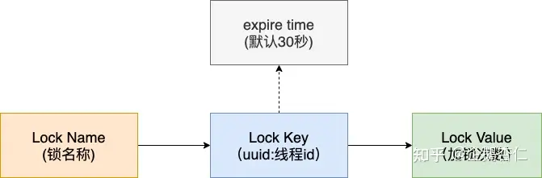

# redis 大Key删除问题

## 什么是大Key，会有什么问题
大key不止止是key本身很大（反而这个场景很少见），其实也是redis的value特别大。
* 执行大key相关读取或者删除操作时，会严重占用带宽和CPU，影响其他客户端
* 执行大key删除时，可能阻塞线程，导致线程池耗尽

## 删除大key
对于string类型的key/value,删除操作是O(1)的。所以string类型的大key主要出现的是带宽的问题。

对于List Set Hash Zset 这种集合类的，删除是O(N)的时间复杂度。在集合中元素特别多的时候，删除key会特别久。

可以使用两个思路删除大key
* 逐步删除
* 异步删除

# redis分布式锁可重入的问题
分布式锁是怎么实现可重入的（防止其他线程释放掉当前线程的锁）。
很显然，需要将线程id和分布式锁结合。两个思路
*  threadLocal

利用ThreadLocal实现，获取锁后将Redis中的value保存在ThreadLocal中，同一线程再次尝试获取锁的时候就先将 ThreadLocal 中的 值 与 Redis 的 value 比较，如果相同则表示这把锁所以该线程，即实现可重入锁。

* redission的实现

从上面这张图可以看出来 Redisson 的分布式锁在 Redis 中的 hash 数据结构：{锁名}:{uuid:threadId}:{count}，另外对于已经存在的健值对初始化过期时间为 30 秒。
* 某一个节点下的线程加锁首先判断该线程对于的 hash 键是否存在
* 若不存在(锁未被持有)，则将锁的键设置为线程 id 对应的唯一标识，值为 1 (第一次加锁),返回空表示加锁成功
* 锁存在且对应的是本线程，说明之前加锁的线程为同一个，则将 hash 值 1 (加锁次数，可重入)，另外将该锁对应的存活时间重新设置，返回空表示加锁成功
* 锁存在但键对应的不是当前线程，说明持有锁的是其他线程，返回锁剩余的过期时间表示加锁失败

## redission的watch dog机制
如果线程处理一个业务逻辑时间较长，导致锁过期，此时其他线程进来操作资源，分布式锁就失效了。

如果拿到分布式锁的节点宕机，且这个锁正好处于锁住的状态时，会出现锁死的状态，为了避免这种情况的发生，锁都会设置一个过期时间。这样也存在一个问题，加入一个线程拿到了锁设置了30s超时，在30s后这个线程还没有执行完毕，锁超时释放了，就会导致问题，Redisson给出了自己的答案，就是 watch dog 自动延期机制。

Redisson提供了一个监控锁的看门狗，它的作用是在Redisson实例被关闭前，不断的延长锁的有效期，也就是说，如果一个拿到锁的线程一直没有完成逻辑，那么看门狗会帮助线程不断的延长锁超时时间，锁不会因为超时而被释放。

默认情况下，看门狗的续期时间是30s，也可以通过修改Config.lockWatchdogTimeout来另行指定。

另外Redisson 还提供了可以指定leaseTime参数的加锁方法来指定加锁的时间。超过这个时间后锁便自动解开了，不会延长锁的有效期。

* watch dog 在当前节点存活时每10s给分布式锁的key续期 30s；
* watch dog 机制启动，且代码中没有释放锁操作时，watch dog 会不断的给锁续期；
* 从可2得出，如果程序释放锁操作时因为异常没有被执行，那么锁无法被释放，所以释放锁操作一定要放到 finally {} 中；

锁释放失败会无限延期吗？

不会，因为无论释放锁操作是否成功，EXPIRATION_RENEWAL_MAP中的目标 ExpirationEntry 对象已经被移除了，watch dog 通过判断后就不会继续给锁续期了。

简单来说，释放锁之前先把这个线程的watchdog移除了。也不会续期。释放失败等待自动到期就可以

# redis内存占用飙升排查思路
* 写入数据太多，redis还来不及清楚数据，导致内存飙升，oom
* 过期时间设置不合理
* 由于大key的出现导致各个节点内存使用不均匀，部分节点oom
* jedis pool资源池问题。空闲的链接会影响占用的内存，关注max idle（最大连接数）参数

# 热key为大key的解决思路
比如在秒杀场景，商详数据放到redis中。是个大key且为热key。
* 拆分大key
* 本地缓存
