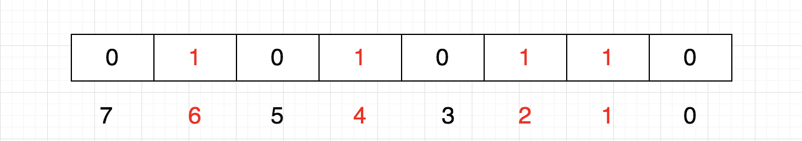
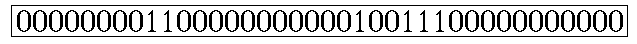

##  Bitmap
Bit-map的基本思想就是用一个bit位来标记某个元素对应的Value，而Key即是该元素。由于采用了Bit为单位来存储数据，因此在存储空间方面，可以大大节省。（PS：划重点 节省存储空间）

假设有这样一个需求：在20亿个随机整数中找出某个数m是否存在其中，并假设32位操作系统，4G内存

在Java中，int占4字节，1字节=8位（1 byte = 8 bit）

如果每个数字用int存储，那就是20亿个int，因而占用的空间约为  (2000000000*4/1024/1024/1024)≈7.45G

如果按位存储就不一样了，20亿个数就是20亿位，占用空间约为  (2000000000/8/1024/1024/1024)≈0.233G

## 如何表示数
每一位表示一个数，0表示不存在，1表示存在，这正符合二进制

这样我们可以很容易表示{1,2,4,6}这几个数：

那如果数据多了呢？多几个数组呗。假设一个数组存储32个数，

tmp[0]：可以表示0~31

tmp[1]：可以表示32~63

tmp[2]：可以表示64~95

给定任意整数M，那么M/32就得到下标，M%32就知道它在此下标的哪个位置。

## bitmap的作用
### 快速去重

20亿个整数中找出不重复的整数的个数，内存不足以容纳这20亿个整数。

首先，根据“内存空间不足以容纳这05亿个整数”我们可以快速的联想到Bit-map。下边关键的问题就是怎么设计我们的Bit-map来表示这20亿个数字的状态了。其实这个问题很简单，一个数字的状态只有三种，分别为不存在，只有一个，有重复。因此，我们只需要2bits就可以对一个数字的状态进行存储了，假设我们设定一个数字不存在为00，存在一次01，存在两次及其以上为11。那我们大概需要存储空间2G左右。

接下来的任务就是把这20亿个数字放进去（存储），如果对应的状态位为00，则将其变为01，表示存在一次；如果对应的状态位为01，则将其变为11，表示已经有一个了，即出现多次；如果为11，则对应的状态位保持不变，仍表示出现多次。

最后，统计状态位为01的个数，就得到了不重复的数字个数，时间复杂度为O(n)。

## Q：40亿个URL怎么找重复
使用bitmap,但是不是int不能直接使用。
1. 求hashcode，转换为int。相同的url的hashcode必定相同
2. hashcode取余分组
3. 同组hashset去重

### bitmap的进一步压缩
可以对记录的二进制数据进行压缩。常见的二进制压缩技术都是基于RLE（Run Length Encoding，详见http://en.wikipedia.org/wiki/Run-length_encoding）。

RLE编码很简单，比较适合有很多连续字符的数据，比如以下边的Bitmap为例：

可以编码为0,8,2,11,1,2,3,11

其意思是:第一位为0，连续有8个，接下来是2个1，11个0，1个1，2个0，3个1，最后是11个0（当然此处只是对RLE的基本原理解释，实际应用中的编码并不完全是这样的）。