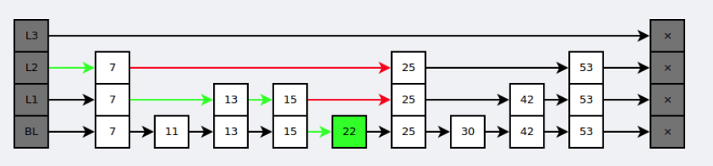

## redis字典实现
dictht 是一个散列表结构，使用拉链法解决哈希冲突。

Redis 使用链地址法来解决键冲突。每个哈希表节点有一个next指针，多个哈希表节点通过next 指针构成一个单向链表。因为 dictEntry 节点组成的链表没有指向链表表尾的指针，所以为了速度考虑，
总是将新节点添加到链表的表头位置（复杂度为O(1)）,排在其他已有节点前面。（k2，v2）是新添加的节点。

### rehash
随着操作的不断执行，哈希表保存的键值对会逐渐的增多或减少，为了让哈希表的负载因子维持在一个合理的阈值之内，当哈希表的键值对的数量太多或太少时，对哈希表进行相应的扩展或收缩。

扩展和收缩哈希表通过rehash（重新散列）进行，具体步骤如下

1. 为字典ht[1]分配空间，这个哈希表空间大小取决于要执行的操作，以及ht[0]当前包含的键值对的数量（也就是ht[0].used属性）
    * 扩展操作：ht[1]的大小为第一个大于等于ht[0].used * 2 的 2^n(2的n次幂)
    * 收缩操作：ht[1]的大小为第一个大于等于ht[0].used 的 2^n
2. 将保存在ht[0]中的所有键值对 rehash 到 ht[1]上面：rehash 是指重新计算键的哈希值和索引值，然后将键值对放到 ht[1]哈希表的指定位置
3. 当ht[0]全部迁移到ht[1]后，释放ht[0]，将ht[1] 设置为 ht[0]，并在 ht[1]上新建一个空白哈希表，为下一次 rehash 做准备。

### 渐进式rehash
为了避免键值对过多的 rehash（涉及到庞大的计算量） 对服务器性能造成影响，服务器不是一次将ht[0] 上的所有键值对 rehash 到 ht[1]，而是分多次、渐进式的将 ht[0] 里所有的键值对进行迁移。

渐进式hash 的步骤：
1. 为ht[1]分配空间，让字典同时持有 ht[0] ht[1]
2. 在字典中维持一个索引计数器变量 rehashidx，并将其设置为0，标识 rehash 开始
3. 在 rehash 期间，每次对字典的添加、删除、查找或更新等，程序除了执行指定的操作外，还会将ht[0] 哈希表在 rehashidx 索引上的所有键值对 rehash 到 ht[1] 上，当rehash 完成后，程序将 rehashidx 值加一。
4. 最终，ht[0]全部 rehash 到 ht[1] 上，这时程序将 rehashidx 值设置为 -1，标识 rehash 完成

渐进式rehash 将rehash 的工作均摊到每个添加、删除、查找和更新中，从而避免集中rehash带来的问题。

## 跳表
跳跃表是基于多指针有序链表实现的，可以看成多个有序链表。也就是redis有序集合底层实现。

在查找时，从上层指针开始查找，找到对应的区间之后再到下一层去查找。下图演示了查找 22 的过程。

当大量新节点插入时，上层索引会不够用。跳表采用抛硬币的方法决定哪些节点提到上一层。

跳表删除节点就是向上将所有同个节点都删除。

与红黑树等平衡树相比，跳跃表具有以下优点：
* 插入速度非常快速，因为不需要进行旋转等操作来维护平衡性；
* 更容易实现；
* 支持无锁操作。

