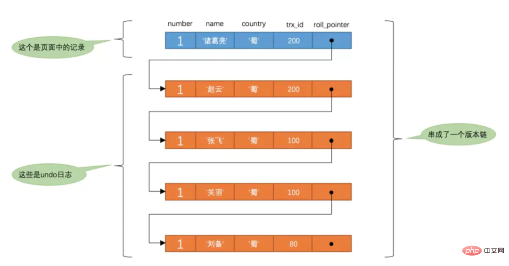
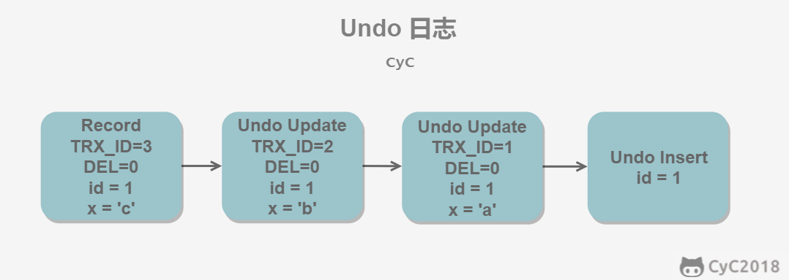
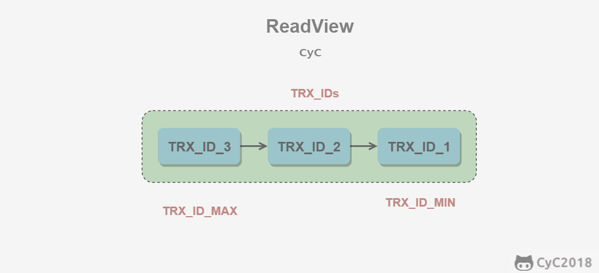

## MySQL事务四大特性
四大特性：原子性、一致性、隔离性、持久性
* 原子性 ： MySQL 中的包含事务的操作要么全部成功、要么全部失败回滚
* 一致性 ；一致性指的是一个事务在执行前后其状态一致。比如 A 和 B 加起来的钱一共是 1000 元，那么不管 A 和 B 之间如何转账，转多少次，事务结束后两个用户的钱加起来还得是 1000，这就是事务的一致性。
* 持久性 ：持久性指的是一旦事务提交，那么发生的改变就是永久性的，即使数据库遇到特殊情况比如故障的时候也不会产生干扰。
* 隔离性 ：多个用户同时操作，排除其他事务对本次事务的影响

PS：
Redis事务**没有隔离级别**的概念，也不支持roll back。
Redis单条命令保证原子性，但是**Redis事务不保证原子性**。

## 事务的隔离级别：

1. 读未提交：

事务中的修改，即使没有提交，对其它事务也是可见的。

2. 读已提交

一个事务只能读取已经提交的事务所做的修改。换句话说，一个事务所做的修改在提交之前对其它事务是不可见的。

3. 可重复读

保证在同一个事务中多次读取同一数据的结果是一样的。

4. 可串行化

强制事务串行执行，这样多个事务互不干扰，不会出现并发一致性问题。
该隔离级别需要加锁实现，因为要使用加锁机制保证同一时间只有一个事务执行，也就是保证事务串行执行。

| 事务隔离级别 | 脏读   | 不可重复读 | 幻读   |
| ------------ | ------ | ---------- | ------ |
| 读未提交     | 允许   | 允许       | 允许   |
| 读已提交     | 不允许 | 允许       | 允许   |
| 可重复读     | 不允许 | 不允许     | 允许   |
| 串行化       | 不允许 | 不允许     | 不允许 |

其中隔离级别由低到高是：读未提交 < 读已提交 < 可重复读 < 串行化

隔离级别越高，越能够保证数据的完整性和一致性，但是对并发的性能影响越大。大多数数据库的默认级别是读已提交(Read committed)，比如 Sql Server、Oracle ，
**但是 MySQL 的默认隔离级别是 可重复读(repeatable-read)。**

## 几种读取问题
脏读：一个事务读取了另一个事务未提交的数据

不可重复读：B事务读取到了A事务已经提交的数据，即B事务在A事务提交前后读取到的数据不一致

**幻读：一个事务内读取了别的事务插入的数据，导致前后不一致**

## SQL如何实现隔离级别
多版本并发控制（Multi-Version Concurrency Control, MVCC）是 MySQL 的 InnoDB 存储引擎实现隔离级别的一种具体方式，用于实现提交读和可重复读这两种隔离级别。

而未提交读隔离级别总是读取最新的数据行，要求很低，无需使用 MVCC。
可串行化隔离级别需要对所有读取的行都加锁，单纯使用 MVCC 无法实现。

MVCC 利用了多版本的思想，写操作更新最新的版本快照，而读操作去读旧版本快照，没有互斥关系，这一点和 CopyOnWrite 类似。
在 MVCC 中事务的修改操作（DELETE、INSERT、UPDATE）会为数据行新增一个版本快照。

## 快照读：
单纯的select操作，不包括 select ... lock in share mode, select ... for update。

* Read Committed隔离级别：每次select都生成一个快照读。
* Read Repeatable隔离级别：开启事务后第一个select语句才是快照读的地方，而不是一开启事务就快照读。
* 在快照读（snapshot read）的情况下，MySQL通过MVCC（多版本并发控制）来避免幻读。

### 版本链

在InnoDB引擎表中，它的聚簇索引记录中有两个必要的隐藏列：

* trx_id
    * 这个id用来存储的每次对某条聚簇索引记录进行修改的时候的事务id。

* roll_pointer
    * 每次对哪条聚簇索引记录有修改的时候，都会把老版本写入undo日志中。这个roll_pointer就是存了一个指针，它指向这条聚簇索引记录的上一个版本的位置，通过它来获得上一个版本的记录信息。(注意插入操作的undo日志没有这个属性，因为它没有老版本)

每次对数据库记录进行改动，都会记录一条undo日志，每条undo日志也都有一个roll_pointer属性，可以将这些undo日志都连起来，串成一个链表，所以现在的情况就像下图一样：



所有的版本都会被roll_pointer属性连接成一个链表，我们把这个链表称之为版本链，版本链的头节点就是当前记录最新的值。另外，每个版本中还包含生成该版本时对应的事务id，在根据ReadView判断版本可见性的时候会用到。

### Undo日志
MVCC 的多版本指的是多个版本的快照，快照存储在 Undo 日志中，该日志通过回滚指针 ROLL_PTR 把一个数据行的所有快照连接起来。

例如在 MySQL 创建一个表 t，包含主键 id 和一个字段 x。我们先插入一个数据行，然后对该数据行执行两次更新操作。
```sql
INSERT INTO t(id, x) VALUES(1, "a");
UPDATE t SET x="b" WHERE id=1;
UPDATE t SET x="c" WHERE id=1;
```



快照中除了记录事务版本号 TRX_ID 和操作之外，还记录了一个 bit 的 DEL 字段，用于标记是否被删除。如果使用到删除，DEL会被改为1

### ReadView
MVCC 维护了一个 ReadView 结构，主要包含了当前系统未提交的事务列表 TRX_IDs {TRX_ID_1, TRX_ID_2, ...}，还有该列表的最小值 TRX_ID_MIN 和 TRX_ID_MAX。



在进行 SELECT 操作时，根据数据行快照的 TRX_ID 与 TRX_ID_MIN 和 TRX_ID_MAX 之间的关系，从而判断数据行快照是否可以使用：

* TRX_ID < TRX_ID_MIN，表示该数据行快照时在当前所有未提交事务之前进行更改的，因此可以使用。

* TRX_ID > TRX_ID_MAX，表示该数据行快照是在事务启动之后被更改的，因此不可使用。

* TRX_ID_MIN <= TRX_ID <= TRX_ID_MAX：判断当前ID在不在队列中
    * 不存在：则说明read view产生的时候事务已经commit了，这种情况数据则可以显示。
    * 已存在：则代表我Read View生成时刻，你这个事务还在活跃，还没有Commit，你修改的数据，我当前事务也是看不见的。

已提交读隔离级别下的事务在每次查询的开始都会生成一个独立的ReadView,而可重复读隔离级别则在第一次读的时候生成一个ReadView，之后的读都复用之前的ReadView

在数据行快照不可使用的情况下，需要沿着 Undo Log 的回滚指针 ROLL_PTR 找到下一个快照，再进行上面的判断。

* 在RR级别下的某个事务的对某条记录的第一次快照读会创建一个快照及Read View， 将当前系统活跃的其他事务记录起来，此后在调用快照读的时候，还是使用的是同一个ReadView，
  所以只要当前事务在其他事务提交更新之前使用过快照读，那么之后的快照读使用的都是同一个Read View，所以对之后的修改不可见；

* 即RR级别下，快照读生成Read View时，Read View会记录此时所有其他活动事务的快照，这些事务的修改对于当前事务都是不可见的。而早于Read View创建的事务所做的修改均是可见

## 什么业务下会用到快照读对数据读两次
管理一个银行账户表，一个表存放月底余额，一个表存放账单明细。在校对中，不希望有新的交易对校对结果产生影响。

此时使用可重复读，就可以理解为事务启动时是静态的，不受其他事务的影响。

## MVCC为什么不能解决当前读下的幻读
忽略了每个事务进行第一次 select 的快照实际上是可能不一样的。因为每个事务开始的时候 活跃的事务不一样，不仅仅要考虑事务的创建时间的顺序，还要考虑这些事务是不是还没有结束。

## 当前读

常用当前读：

```sql
select...lock in share mode (共享读锁)
   
select...for update
   
update , delete , insert
```

当前读, 读取的是最新版本, 并且对读取的记录加锁, 阻塞其他事务同时改动相同记录，避免出现安全问题。

MVCC 其它会对数据库进行修改的操作（INSERT、UPDATE、DELETE）需要进行加锁操作，从而读取最新的数据。可以看到 MVCC 并不是完全不用加锁，而只是避免了 SELECT 的加锁操作。
* 在当前读（current read）的情况下，MySQL通过next-key lock来避免幻读。

# Next-Key Locks
Next-Key Locks 是 MySQL 的 InnoDB 存储引擎的一种锁实现。

MVCC 不能解决当前读幻影读问题，Next-Key Locks 就是为了解决这个问题而存在的。在可重复读（REPEATABLE READ）隔离级别下，使用 MVCC + Next-Key Locks 可以解决幻读问题。

innoDB支持三种行锁定方式：

* 行锁（Record Lock）：锁直接加在索引记录上面（无索引项时演变成表锁）。

* 间隙锁（Gap Lock）：锁定索引记录间隙，确保索引记录的间隙不变。间隙锁是针对事务隔离级别为可重复读或以上级别的。

* Next-Key Lock ：行锁和间隙锁组合起来就是 Next-Key Lock。

innoDB默认的隔离级别是可重复读(Repeatable Read)，并且会以Next-Key Lock的方式对数据行进行加锁。Next-Key Lock是行锁和间隙锁的组合，
当InnoDB扫描索引记录的时候，会首先对索引记录加上行锁（Record Lock），再对索引记录两边的间隙加上间隙锁（Gap Lock）。加上间隙锁之后，其他事务就不能在这个间隙修改或者插入记录。

当查询的索引含有唯一属性（唯一索引，主键索引）时，Innodb存储引擎会对next-key lock进行优化，将其降为record lock,即仅锁住索引本身，而不是范围。

```sql
update user set age=11 where age=10
```
如果表中并没有为 age 字段设置索引，MySQL 无法直接定位到这行数据。
MySQL 会为这张表中所有行加行锁，在加上行锁后，MySQL 会进行一遍过滤，发现不满足的行就释放锁，最终只留下符合条件的行。
虽然最终只为符合条件的行加了锁，但是这一锁一释放的过程对性能也是影响极大的。
