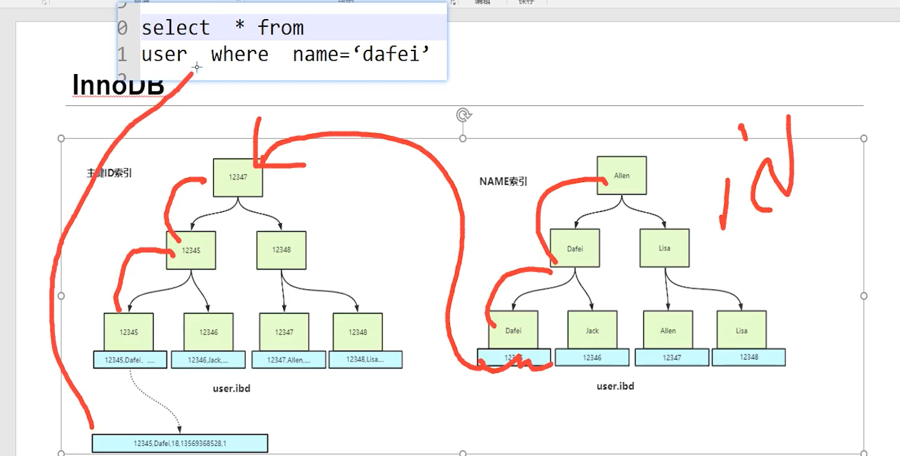
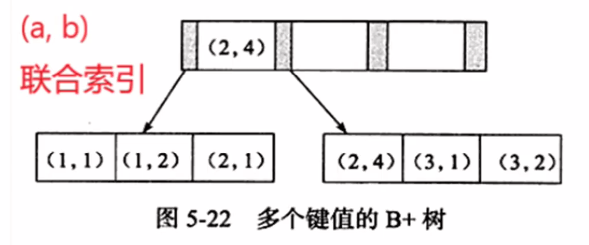
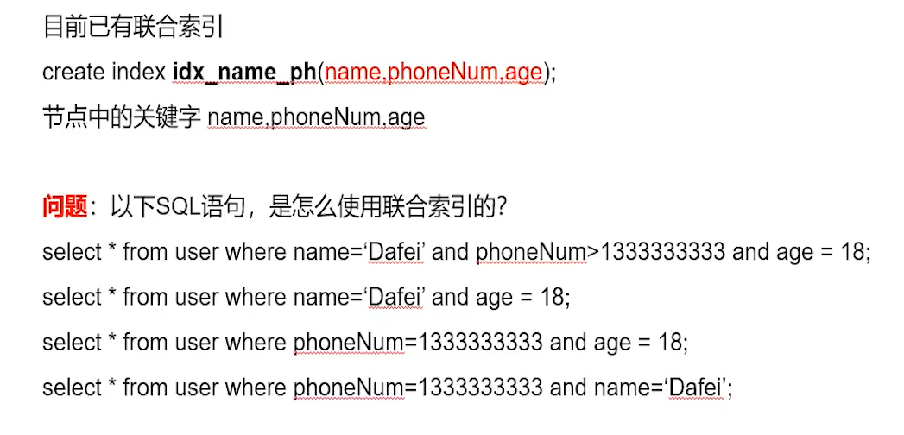
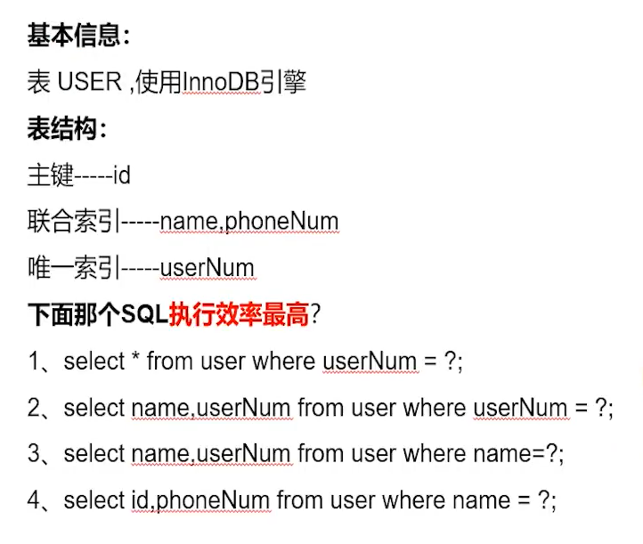

# 索引
MySQL官方对索引的定义为：索引（Index）是帮助MySQL高效获取数据的数据结构。        
提取句子主干，就可以得到索引的本质：索引是数据结构。

## 索引的分类
* 主键索引（PRIMARY KEY）
    * 唯一的标识，主键不可重复，只能有一个
* 唯一索引（UNIQUE KEY）
    * 避免重复的列出现。
    * 唯一索引可以重复，可以多个列设置唯一索引
* 常规索引（KEY INDEX）
    * 默认的index。key关键字设置
* 全文索引（FULLTEXT）
    * 特定数据库才有，MyISAM
    * 快速定位数据
    
## B+Tree
MySQL普遍使用B+Tree实现其索引结构。

红黑树等平衡树也可以用来实现索引，但是文件系统及数据库系统普遍采用 B+ Tree 作为索引结构，这是因为使用 B+ 树访问磁盘数据有更高的性能。

1. 为什么要用树？

hash可以做到查找更快，但是数据库需要更多的是范围查询而不是单条操作。树**有序**，可以提高效率；

2. 二叉搜索树，AVL的问题

树高太高，IO次数多
   
节点里只有一个关键字，每次IO获取的数据太小（IO吞吐差）
* innodb_page_size默认是16kb，而二叉搜索树，一个节点int（4byte），两个指针（各6byte）使用的空间太少。

3. B-tree

mongodb使用了B-tree

B-tree特点
* 每个节点的关键字由1->N
    * 每个节点包括了关键字，数据区，引用。  
    * 节点内关键字数量为树的度-1；
* 绝对平衡，又有节点都在同一水平线。

4. B+Tree

B+Tree和B-Tree的区别
* B+Tree关键字个数与路数1:1
* 只有叶子节点有数据区
* 数据区间划分有所区别
    * 比如B-Tree的[5,20]，说明这个节点存储了5,20，然后（-无穷，5），（5,20），（20，+无穷）三个区间
    * 然后B+Tree的[5,20],划分weile[5,20),[20,+无穷)两个区间。
    
B+Tree的优点：
* 扫表操作B-Tree需要中序遍历，而B+Tree只需要遍历叶子节点
* 由于B+Tree叶子节点有序，基于索引的排序非常优秀
* 在范围查询时，B-Tree会有类似回溯的操作，而B+Tree只需要遍历。
* 在同样的innodb_page_size下，由于B+Tree只需要关键字和指针，一次可以读取的数据就更多，所以IO吞吐能力更强。

## mysql 主键和唯一索引的区别
主键是一种约束，唯一索引是一种索引，两者在本质上是不同的。

1. 主键创建后一定包含一个唯一性索引，唯一性索引并不一定就是主键。
2. 唯一性索引列允许空值，而主键列不允许为空值。
3. 主键列在创建时，已经默认为非空值 + 唯一索引了。
4. 主键可以被其他表引用为外键，而唯一索引不能。
5. 一个表最多只能创建一个主键，但可以创建多个唯一索引。
6. 主键和唯一索引都可以有多列。
7. 主键更适合那些不容易更改的唯一标识，如自动递增列、身份证号等。
8. 在 RBO 模式下，主键的执行计划优先级要高于唯一索引。 两者可以提高查询的速度。

## 为什么主键ID是递增的，和B+Tree有什么关联，（为什么不使用UUID）
B+Tree叶子节点天然有序。所以在递增的情况下，增加节点就是一个增加的操作。否则就需要插入操作，效率低。

UUID使用的是varchar，大小比int大，所以同样16kb，能读取的数据量就变小了。
UUID并不一定保证是递增的。可能用到插入操作

## 为什么使用B+树
见上与各种数据结构的比较。

## 聚簇索引

最最核心 ： **Innodb下只有主键索引是聚簇索引。因为只有主键索引带数据。**

* 聚簇索引：将数据存储与索引放到了一块，找到索引也就找到了数据 
  * 优点：
    1. 数据访问更快，因为聚簇索引将索引和数据保存在同一个B+树中，因此从聚簇索引中获取数据比非聚簇索引更快
    2. 聚簇索引对于主键的排序查找和范围查找速度非常快
  * 缺点：

    1. 插入速度严重依赖于插入顺序，按照主键的顺序插入是最快的方式，否则将会出现页分裂，严重影响性能。因此，对于InnoDB表，我们一般都会定义一个自增的ID列为主键
    2. 更新主键的代价很高，因为将会导致被更新的行移动。因此，对于InnoDB表，我们一般定义主键为不可更新。
    3. 二级索引访问需要两次索引查找，第一次找到主键值，第二次根据主键值找到行数据。

* 非聚簇索引：将数据存储于索引分开结构，索引结构的叶子节点指向了数据的对应行，myisam通过key_buffer把索引先缓存到内存中，当需要访问数据时（通过索引访问数据），在内存中直接搜索索引，然后通过索引找到磁盘相应数据，这也就是为什么索引不在key buffer命中时，速度慢的原因

聚簇索引默认是主键，如果表中没有定义主键，InnoDB 会选择一个唯一的非空索引代替。如果没有这样的索引，InnoDB 会隐式定义一个主键来作为聚簇索引。InnoDB 只聚集在同一个页面中的记录。包含相邻健值的页面可能相距甚远。

如果你已经设置了主键为聚簇索引，必须先删除主键，然后添加我们想要的聚簇索引，最后恢复设置主键即可。

### 为什么要自定义主键，不使用隐藏主键
1. 隐藏主键的int是6byte，自定义的是4byte，浪费空间。
2. 在sql事务中，如果update操作需要用到锁，使用自定义的主键是行锁，而使用隐藏主键是表锁，大大降低性能。

## 在InnoDB中，如果建立了一个非主键索引，怎么查？

如图。我们按列name的非主键索引查name = ’dafei‘，查到的是对应的id，也就是主键。

然后我们再去主键索引里面查，查到对应的数据再返回。

* 非主键索引在Innodb引擎下存储的是主键ID，因为只有主键才能查到值

## 稀疏索引
冷门。简单来说就是不能一次查到值的索引方式。

* MyISAM下各种索引都是稀疏索引。
* Innodb下非主键是稀疏索引。

## 建立索引的要求
1. 离散性。一列数据中不能有大量的重复元素。

## 联合索引、覆盖索引
### 联合索引的最左匹配原则
比如建立了（name,phonenum,age）的联合索引。那么可以理解为建立了（name）（name，phonenum）（name，phonenum，age）三个索引。

联合索引的数据结构依然是B+树，只是换成了键值对。

联合索引时，B+Tree的数据结构
* a是有序的,b无序
* 在a是相同的情况下，b是有序的

所以，必须按照最左前缀原则依次向后，才能保证是有序的。否则无序则索引失效

对于以下三种情况：
* 查询（’df‘，’133‘，’18‘），依次向后匹配，索引可以查到
* 查询（’133‘，’18‘）第一个不为num，用不到这个联合索引
* 查询（’df','18'）由于name后面不是age，所以会利用索引查出所有name为df的人，再依次匹配年龄找到结果。

1. 第一条使用了两列
    * 第一条由于使用了范围，后续的数据对于下一个变量不再有序，且离散性极差，不再使用索引。
2. 第二条使用了一列（最左匹配）
3. 使用0列（最左匹配）
4. 使用了两列索引
    * sql的执行顺序会有优化。mysql有优化器。但是还是消耗了性能，所以建议还是and前后交换一下

sql优化口诀 ：索引列上上计算，范围之后全失效。 

### 覆盖索引与回表
* 覆盖索引 ：通过索引项的信息可以直接返回所查询的列，就是sql的覆盖索引。

* 回表 ：索引不能直接查到信息，通过查到主键再回到表内通过主键查询信息，这个操作被称为回表

如图，图中第四条执行效率最高，因为联合索引，通过num可以查到id和phonenum，不用回表。

而1,2,3,都不能直接得到所有的信息，需要利用查到的主键id回表再去查，效率低。

sql优化口诀 ：Like百分写最右，覆盖索引不用*。

## 索引失效
1. 不遵守最左前缀原则。
    * 数据不有序了，也就不能用了
    
2. 使用了比较符号。
    * 同样，在a>1的情况下去找b=1，b不有序，依然是要遍历。
    
3. 使用like
    * like的百分号必须在最右。这样可以通过左边部分进行索引
    
4. 不是直接判断索引字段列，而是判断运算或其它函数处理后的索引列索引均不起作用。

