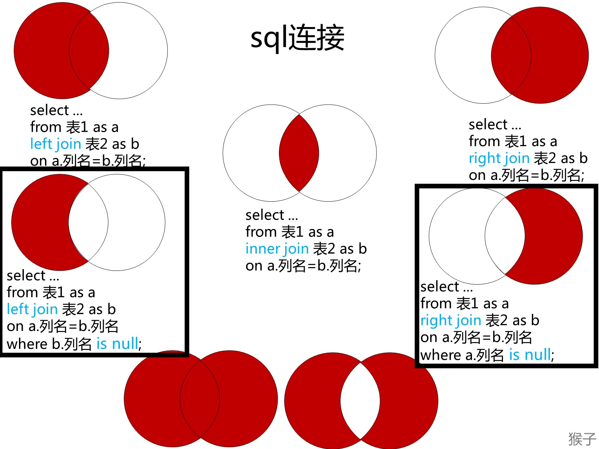

* DISTINCT : 去重

### Limit用法
```sql
limit a,b
```

跳过a行选b行

### group by
把具有相同的数据值的行放在同一组中。

可以对同一分组数据使用汇总函数进行处理，例如求分组数据的平均值等。

指定的分组字段除了能按该字段进行分组，也会自动按该字段进行排序。

WHERE 过滤行，**HAVING 过滤分组**，行过滤应当先于分组过滤。

# 简单练习

## leetcode 182
```
编写一个 SQL 查询，查找Person 表中所有重复的电子邮箱。

+----+---------+
| Id | Email   |
+----+---------+
| 1  | a@b.com |
| 2  | c@d.com |
| 3  | a@b.com |
+----+---------+
根据以上输入，你的查询应返回以下结果：

+---------+
| Email   |
+---------+
| a@b.com |
+---------+

```

WHERE 过滤行，**HAVING 过滤分组**，行过滤应当先于分组过滤。

```sql
SELECT DISTINCT
Email 
FROM Person
group by Email
having count(Email) > 1;
```

## leetcode 596

```
有一个courses 表 ，有: student(学生) 和 class (课程)。

请列出所有超过或等于5名学生的课。

+---------+------------+
| student | class      |
+---------+------------+
| A       | Math       |
| B       | English    |
| C       | Math       |
| D       | Biology    |
| E       | Math       |
| F       | Computer   |
| G       | Math       |
| H       | Math       |
| I       | Math       |
+---------+------------+
应该输出:

+---------+
| class   |
+---------+
| Math    |
+---------+

```

```sql
SELECT
    class
FROM
    courses
GROUP BY
    class
HAVING
    count( DISTINCT student ) >= 5;
```

# sql连接练习

## leetcode183
```
某网站包含两个表，Customers 表和 Orders 表。编写一个 SQL 查询，找出所有从不订购任何东西的客户。

Customers 表：

+----+-------+
| Id | Name  |
+----+-------+
| 1  | Joe   |
| 2  | Henry |
| 3  | Sam   |
| 4  | Max   |
+----+-------+
Orders 表：

+----+------------+
| Id | CustomerId |
+----+------------+
| 1  | 3          |
| 2  | 1          |
+----+------------+
例如给定上述表格，你的查询应返回：

+-----------+
| Customers |
+-----------+
| Henry     |
| Max       |
+-----------+

```

利用sql连接



```sql
select a.Name as Customers
from Customers as a
left join Orders as b
on a.Id=b.CustomerId
where b.CustomerId is null;
```
