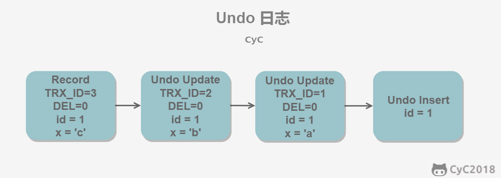
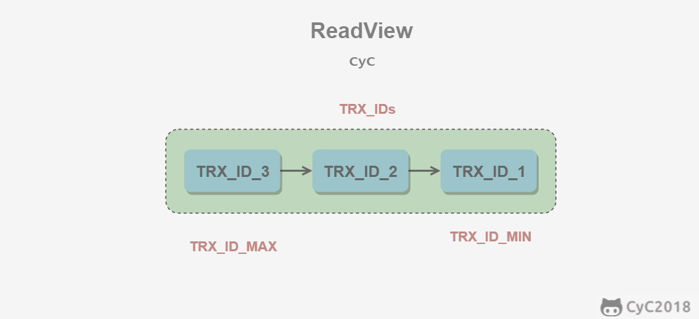

# SQL数据库常见面试题

## 非关系型数据库和关系型数据库区别，优势比较
**关系型数据库就是表与表之间有关系**
非关系型数据库称为 NoSQL，也就是 Not Only SQL，不仅仅是 SQL。非关系型数据库不需要写一些复杂的 SQL 语句，其内部存储方式是以 key-value 的形式存在可以把它想象成电话本的形式，每个人名（key）对应电话（value）。 常见的非关系型数据库主要有 Hbase、Redis、MongoDB 等。     
非关系型数据库的优势：
* 非关系型数据库不需要经过 SQL 的重重解析，所以性能很高；      
* 非关系型数据库的可扩展性比较强，数据之间没有耦合性，遇见需要新加字段的需求，就直接增加一个 key-value 键值对即可。       

关系型数据库以表格的形式存在，以行和列的形式存取数据，关系型数据库这一系列的行和列被称为表，无数张表组成了数据库，常见的关系型数据库有 Oracle、DB2、Microsoft SQL Server、MySQL等。
关系型数据库的优势：
* 关系型数据库能够支持复杂的 SQL 查询，能够体现出数据之间、表之间的关联关系；
* 关系型数据库也支持事务，便于提交或者回滚。

## MySQL事务四大特性
四大特性：原子性、一致性、隔离性、持久性
* 原子性 ： MySQL 中的包含事务的操作要么全部成功、要么全部失败回滚
* 一致性 ；一致性指的是一个事务在执行前后其状态一致。比如 A 和 B 加起来的钱一共是 1000 元，那么不管 A 和 B 之间如何转账，转多少次，事务结束后两个用户的钱加起来还得是 1000，这就是事务的一致性。
* 持久性 ：持久性指的是一旦事务提交，那么发生的改变就是永久性的，即使数据库遇到特殊情况比如故障的时候也不会产生干扰。
* 隔离性 ：多个用户同时操作，排除其他事务对本次事务的影响 

PS：
Redis事务**没有隔离级别**的概念，也不支持roll back。
Redis单条命令保证原子性，但是**Redis事务不保证原子性**。

## 事务的隔离级别：

1. 读未提交：

事务中的修改，即使没有提交，对其它事务也是可见的。

2. 读已提交

一个事务只能读取已经提交的事务所做的修改。换句话说，一个事务所做的修改在提交之前对其它事务是不可见的。

3. 可重复读

保证在同一个事务中多次读取同一数据的结果是一样的。

4. 可串行化

强制事务串行执行，这样多个事务互不干扰，不会出现并发一致性问题。
该隔离级别需要加锁实现，因为要使用加锁机制保证同一时间只有一个事务执行，也就是保证事务串行执行。

| 事务隔离级别 | 脏读   | 不可重复读 | 幻读   |
| ------------ | ------ | ---------- | ------ |
| 读未提交     | 允许   | 允许       | 允许   |
| 读已提交     | 不允许 | 允许       | 允许   |
| 可重复读     | 不允许 | 不允许     | 允许   |
| 串行化       | 不允许 | 不允许     | 不允许 |

其中隔离级别由低到高是：读未提交 < 读已提交 < 可重复读 < 串行化

隔离级别越高，越能够保证数据的完整性和一致性，但是对并发的性能影响越大。大多数数据库的默认级别是读已提交(Read committed)，比如 Sql Server、Oracle ，
**但是 MySQL 的默认隔离级别是 可重复读(repeatable-read)。**

## 几种读取问题
脏读：一个事务读取了另一个事务未提交的数据

不可重复读：B事务读取到了A事务已经提交的数据，即B事务在A事务提交前后读取到的数据不一致

**幻读：一个事务内读取了别的事务插入的数据，导致前后不一致**

## SQL如何实现隔离级别
多版本并发控制（Multi-Version Concurrency Control, MVCC）是 MySQL 的 InnoDB 存储引擎实现隔离级别的一种具体方式，用于实现提交读和可重复读这两种隔离级别。

而未提交读隔离级别总是读取最新的数据行，要求很低，无需使用 MVCC。
可串行化隔离级别需要对所有读取的行都加锁，单纯使用 MVCC 无法实现。

MVCC 利用了多版本的思想，写操作更新最新的版本快照，而读操作去读旧版本快照，没有互斥关系，这一点和 CopyOnWrite 类似。
在 MVCC 中事务的修改操作（DELETE、INSERT、UPDATE）会为数据行新增一个版本快照。

## Undo日志
MVCC 的多版本指的是多个版本的快照，快照存储在 Undo 日志中，该日志通过回滚指针 ROLL_PTR 把一个数据行的所有快照连接起来。

例如在 MySQL 创建一个表 t，包含主键 id 和一个字段 x。我们先插入一个数据行，然后对该数据行执行两次更新操作。
```sql
INSERT INTO t(id, x) VALUES(1, "a");
UPDATE t SET x="b" WHERE id=1;
UPDATE t SET x="c" WHERE id=1;
```



快照中除了记录事务版本号 TRX_ID 和操作之外，还记录了一个 bit 的 DEL 字段，用于标记是否被删除。如果使用到删除，DEL会被改为1

## ReadView
MVCC 维护了一个 ReadView 结构，主要包含了当前系统未提交的事务列表 TRX_IDs {TRX_ID_1, TRX_ID_2, ...}，还有该列表的最小值 TRX_ID_MIN 和 TRX_ID_MAX。



在进行 SELECT 操作时，根据数据行快照的 TRX_ID 与 TRX_ID_MIN 和 TRX_ID_MAX 之间的关系，从而判断数据行快照是否可以使用：

* TRX_ID < TRX_ID_MIN，表示该数据行快照时在当前所有未提交事务之前进行更改的，因此可以使用。

* TRX_ID > TRX_ID_MAX，表示该数据行快照是在事务启动之后被更改的，因此不可使用。

* TRX_ID_MIN <= TRX_ID <= TRX_ID_MAX，需要根据隔离级别再进行判断：

在数据行快照不可使用的情况下，需要沿着 Undo Log 的回滚指针 ROLL_PTR 找到下一个快照，再进行上面的判断。

## 快照读与当前读
1. 快照读
MVCC 的 SELECT 操作是快照中的数据，不需要进行加锁操作。
* 在快照读（snapshot read）的情况下，MySQL通过MVCC（多版本并发控制）来避免幻读。

2. 当前读
MVCC 其它会对数据库进行修改的操作（INSERT、UPDATE、DELETE）需要进行加锁操作，从而读取最新的数据。可以看到 MVCC 并不是完全不用加锁，而只是避免了 SELECT 的加锁操作。
* 在当前读（current read）的情况下，MySQL通过next-key lock来避免幻读。   

# Next-Key Locks
Next-Key Locks 是 MySQL 的 InnoDB 存储引擎的一种锁实现。

MVCC 不能解决当前读幻影读问题，Next-Key Locks 就是为了解决这个问题而存在的。在可重复读（REPEATABLE READ）隔离级别下，使用 MVCC + Next-Key Locks 可以解决幻读问题。

innoDB支持三种行锁定方式：

* 行锁（Record Lock）：锁直接加在索引记录上面（无索引项时演变成表锁）。

* 间隙锁（Gap Lock）：锁定索引记录间隙，确保索引记录的间隙不变。间隙锁是针对事务隔离级别为可重复读或以上级别的。

* Next-Key Lock ：行锁和间隙锁组合起来就是 Next-Key Lock。

innoDB默认的隔离级别是可重复读(Repeatable Read)，并且会以Next-Key Lock的方式对数据行进行加锁。Next-Key Lock是行锁和间隙锁的组合，
当InnoDB扫描索引记录的时候，会首先对索引记录加上行锁（Record Lock），再对索引记录两边的间隙加上间隙锁（Gap Lock）。加上间隙锁之后，其他事务就不能在这个间隙修改或者插入记录。

当查询的索引含有唯一属性（唯一索引，主键索引）时，Innodb存储引擎会对next-key lock进行优化，将其降为record lock,即仅锁住索引本身，而不是范围。

## MySQL常见存储引擎的区别
**InnoDB** 是 MySQL 默认支持的存储引擎，支持**事务、行级锁定和外键。**

在 5.1 版本之前，MyISAM 是 MySQL 的默认存储引擎，MyISAM 并发性比较差，使用的场景比较少，不支持事务操作，不支持外键操作，默认的锁粒度是表级锁，所以并发性能比较差，加锁比较快，锁冲突比较少，不太容易发生死锁的情况。

MyISAM 和 InnoDB 存储引擎的对比：
* InnoDB支持**事务，外键**
* **锁粒度方面**：由于锁粒度不同，InnoDB支持更高的并发；InnoDB 的锁粒度为行锁、MyISAM 的锁粒度为表锁、行锁需要对每一行进行加锁，所以锁的开销更大，但是能解决脏读和不可重复读的问题，相对来说也更容易发生死锁
* **可恢复性**上：由于 InnoDB 是有事务日志的，可以根据日志文件进行恢复。而 MyISAM 则没有事务日志。
* 查询性能上：MyISAM 要优于 InnoDB，因为 InnoDB 在查询过程中，是需要维护数据缓存，而且查询过程是先定位到行所在的数据块，然后在从数据块中定位到要查找的行；而 MyISAM 可以直接定位到数据所在的内存地址，可以直接找到数据。
* 表结构文件上： MyISAM 的表结构文件包括：.frm(表结构定义),.MYI(索引),.MYD(数据)；而 InnoDB 的表数据文件为:.ibd和.frm(表结构定义)；
* InnoDB为聚簇索引，MyISAM为非聚簇索引。

## Q：谈谈 SQL 优化的经验
* 查询语句无论是使用哪种判断条件 等于、小于、大于， **WHERE 左侧的条件查询字段不要使用函数或者表达式**
* 当你的 SELECT 查询语句只需要使用一条记录时，要使用 LIMIT 1
* **不要直接使用**SELECT*，而应该使用具体需要查询的表字段
* 为每一张表设置一个 ID 属性
* 使用 BETWEEN AND 替代 IN
* 为搜索字段创建索引

