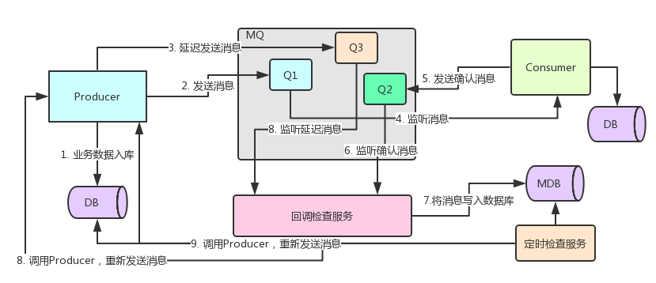

# MQ概述
MQ全称 Message Queue（消息队列），是在消息传输过程中保存消息的容器。多用于分布式系统之间进行通信。

1. MQ—消息队列，存储消息的中间件。
2. 分布式系统通信两种方式：直接远程调用和==借助第三方完成间接通信==。
3. 发送方称为生产者，接收方称为消费者。

## MQ的优劣势
MQ的优势：
1. 应用解耦 ：提高系统的容错性和可维护性
2. 异步提速 : 提升用用户体验和系统吞吐量（单位时间内处理请求的数目）
3. 削峰填谷 ： 提高系统稳定性

MQ的劣势：
1. 系统可用性降低
   * 系统引入的外部依赖越多，系统稳定性能越差。一旦MQ宕机，就会对业务造成影响。
2. 系统的复杂度提高
   * 如何保证消息没有被重复消费，如何处理消息丢失，保证消息传递的顺序性。
3. 一致性问题
   * 如何保证消息数据处理的一致性。 

### 使用 MQ 需要满足什么条件呢？
1. 生产者不需要从消费者处获得反馈。
    * 引入消息队列之前的直接调用，其接口的返回值应该为空，这才让明明下层的动作还没做，上层却当成动作做完了继续往后走，即所谓异步成为了可能。
2. 容许短暂的不一致性。
3. 解耦、提速、削峰这些方面的收益，超过加入MQ，管理MQ这些成本。

# RabbitMQ运转流程
生产者发送消息：
1. 生产者创建连接（connection），开启一个信道，连接到RabbitMQ Broker;
2. 申明队列并设置属性（是否排他，是否持久化，是否自动删除）；
3. 将路由键（空字符串）与队列绑定起来；
4. 发送消息至RabbitMQ Broker；
5. 关闭信道；
6. 关闭连接；

消费者接受消息：
1. 消费者创建连接，开启一个信道，连接到RabbitMQ Broker
2. 向Broker 请求消费相应队列中的消息，设置相应的回调函数；
3. 等待Broker回应闭关投递响应队列中的消息，消费者接收消息；
4. 确认（ack，自动确认）接收到的消息；
5. RabbitMQ从队列中删除相应已经被确认的消息；
6. 关闭信道
7. 关闭连接

# RabbitMQ工作模式
1. Helloworld简单模式
   
2. Work queues工作队列模式：

    * 一个或一些消费端，多个消费端竞争消费同一个队列中的消息。
    * 在一个Work queues队列中如果有多个消费者，那么消费者之间对于同一个消息的关系是竞争的关系

3. Publish/Subscribe发布订阅模式

   
    * P：生产者，不再发送消息到队列中，而是发给X（交换机）
    * C：消费者，消息的接受者，会一直等待消息到来。
    * Queue：消息队列，接收消息、缓存消息。
    * Exchange：交换机，图中的X。一方面，接收生产者发送的消息。另一方面，知道如何处理消息，例如递交给某个特别队列、递交给所有队列、或是将消息丢弃。到底如何操作，取决于Exchange的类型。Exchange有常见以下3种类型：
        * Fanout：广播，将消息交给所有绑定的交换机的队列
        * Direct：定向，把消息交给符合指定routing key的队列
        * Topic：通配符，把消息交给符合routing pattern（路由模式）的队列
    
总结：     
* 交换机需要与队列进行绑定，绑定之后；一个消息可以被多个消费者收到。
* 布订阅模式与工作队列模式的区别，重点还是在交换机上面
* 工作队列模式不用定义交换机，而发布/订阅模式需要定义交换机。
* 发布/订阅模式的**生产方是面向交换机发送消息**，工作队列模式的生产方是**面向队列发送消息**(底层使用默认交换机)。
* 发布/订阅模式需要**设置队列和交换机的绑定**，工作队列模式不需要设置，实际上工作队列模式会将队列绑定到默认的交换机 。

4. Routing路由模式
   

    * 队列与交换机的绑定，不能是任意绑定了，而是要指定一个RoutingKey（路由key）
    * 消息的发送方在向Exchange发送消息时，也必须指定消息的 RoutingKey。
    * Exchange不再把消息交给每一个绑定的队列，而是根据消息的Routing Key进行判断，只有队列的Routingkey与消息的 Routing key完全一致，才会接收到消息
    * Routing模式要求队列在绑定交换机时要指定routing key，消息会转发到符合routing key的队列。

5. Topics通配符模式

Topic类型与Direct相比，都是可以根据RoutingKey把消息路由到不同的队列。只不过Topic类型Exchange可以让队列在绑定Routing key 的时候使用通配符！

Routingkey 一般都是有一个或多个单词组成，多个单词之间以”.”分割，例如： item.insert

通配符规则：

'#' ：匹配一个或多个词

'*' ：匹配不多不少恰好1个词

举例：

item.#：能够匹配item.insert.abc 或者 item.insert
item.*：只能匹配item.insert

# RabbitMQ高级特性
## 消息的可靠投递
rabbitmq 整个消息投递的路径为：

* producer—>rabbitmq-broker—>exchange—>queue—>consumer
    * 对于RabbitMQ来说，一个RabbitMQ Broker可以简单地看作一个RabbitMQ服务节点，或者 RabbitMQ服务实例 。
    * exchange到queue需要路由算法

在使用 RabbitMQ 的时候，作为消息发送方希望杜绝任何消息丢失或者投递失败场景。RabbitMQ 为我们提供了两种方式用来控制消息的投递可靠性模式。

* confirm 确认模式
    * 消息从 producer 到 exchange 则会返回一个 confirmCallback()。都会执行，返回false就失败
* return 退回模式
    * 消息从 exchange–>queue 投递失败则会返回一个 returnCallback()。
    * 如果消息没有到Queue,则丢弃消息（默认）
    * 如果有消息没有路由到Queue,则返回给消息发送方 returnCallback
我们利用这两个 callback 控制消息的可靠性投递

消息的可靠投递小结

* 设置ConnectionFactory的publisher-confirms="true"开启 **确认模式。**
* 使用rabbitTemplate.setConfirmCallback设置回调函数。当消息发送到exchange后回调confirm方法。在方法中判断ack，如果为true，则发送成功，如果为false，则发送失败，需要处理。
* 设置ConnectionFactory的publisher-returns="true"开启 **退回模式。**
* 使用rabbitTemplate.setReturnCallback设置退回函数，当消息从exchange路由到queue失败后，如果设置了rabbitTemplate.setMandatory(true)参数，则会将消息退回给producer。并执行回调函数returnedMessage。

## Consumer Ack
消息端收到消息后的确认方式。

有三种确认方式：
* 自动确认：acknowledge="none" 。不管处理成功与否，业务处理异常也不管
* 手动确认：acknowledge="manual" 。可以解决业务异常的情况
* 根据异常情况确认：acknowledge="auto"，（这种方式使用麻烦）

其中自动确认是指，当消息一旦被Consumer接收到，则自动确认收到，并将相应 message 从 RabbitMQ 的消息缓存中移除。

但是在实际业务处理中，很可能消息接收到，业务处理出现异常，那么该消息就会丢失。如果设置了手动确认方式，则需要在业务处理成功后，调用channel.basicAck()，手动签收，如果出现异常，则调用channel.basicNack()方法，让其自动重新发送消息。

* 在rabbit:listener-container标签中设置acknowledge属性，设置ack方式 none：自动确认，manual：手动确认
* 如果在消费端没有出现异常，则调用channel.basicAck(deliveryTag,false);方法确认签收消息
* 如果出现异常，则在catch中调用 basicNack或 basicReject，拒绝消息，让MQ重新发送消息。

消息的可靠性总结
1. 持久化：
    * exchange要持久化
    * queque要持久化
    * message要持久化
2. 生产方确认Confirm
3. 消费方确认Ack
4. Broker高可用

## 消费端限流
> 假如我们rabbitmq服务器有上万条未处理的消息，我们随便打开一个消费者客户端，会出现下面的情况：
巨量的消息瞬间全部推送过来，但是我们单个客户端无法同时处理这么多的数据。
rabbitmq提供了一种服务质量保障功能，即在非自动确认消息的前提下，如果一定数目的消息未被确认，不进行消费新的消息。

* 在rabbit:listener-container中配置 prefetch属性设置消费端一次拉取多少消息
* 消费端的确认模式一定为手动确认。acknowledge=“manual”

## TTl
全称 ： Time To Live(存活时间/过期时间)

RabbitMQ可以对消息设置过期时间，也可以对整个队列设置过期时间。当消息到达存活时间后，还没被消费，就会被自动清除

可以在管理台新建队列、交换机，绑定

* 设置队列过期时间使用参数：x-message-ttl，单位：ms(毫秒)，会对整个队列消息统一过期。
* 设置消息过期时间使用参数：expiration。单位：ms(毫秒)，当该消息在队列头部时（消费时），会单独判断这一消息是否过期。

如果两者都进行了设置，以时间短的为准。

## 死信队列
死信队列，英文缩写：DLX 。Dead Letter Exchange（死信交换机，因为其他MQ产品中没有交换机的概念），当消息成为Dead message后，可以被重新发送到另一个交换机，这个交换机就是DLX。

比如消息队列的消息过期，如果绑定了死信交换器，那么该消息将发送给死信交换机

消息成为死信的三种情况：

* 队列消息长度到达限制；
* 消费者拒接消费消息，basicNack/basicReject,并且不把消息重新放入原目标队列,requeue=false；
* 原队列存在消息过期设置，消息到达超时时间未被消费；

队列绑定死信交换机：

给队列设置参数： x-dead-letter-exchange 和 x-dead-letter-routing-key

小结：

* 死信交换机和死信队列和普通的没有区别
* 当消息成为死信后，如果该队列绑定了死信交换机，则消息会被死信交换机重新路由到死信队列

## 延迟队列（重点）
延迟队列，即消息进入队列后不会立即被消费，只有到达指定时间后，才会被消费。

需求：

* 下单后，30分钟未支付，取消订单，回滚库存。
* 新用户注册成功7天后，发送短信问候。

可以使用：TTL+死信队列 组合实现延迟队列的效果。

## 日志与监控
RabbitMQ默认日志存放路径： /var/log/rabbitmq/rabbit@xxx.log

日志包含了RabbitMQ的版本号、Erlang的版本号、RabbitMQ服务节点名称、cookie的hash值、RabbitMQ配置文件地址、内存限制、磁盘限制、默认账户guest的创建以及权限配置等等。

## 消息追踪
firehose的机制是将生产者投递给rabbitmq的消息，rabbitmq投递给消费者的消息按照指定的格式发送到默认的exchange上。这个默认的exchange的名称为amq.rabbitmq.trace，它是一个topic类型的exchange。发送到这个exchange上的消息的routing key为 publish.exchangename 和 deliver.queuename。其中exchangename和queuename为实际exchange和queue的名称，分别对应生产者投递到exchange的消息，和消费者从queue上获取的消息。

注意：打开 trace 会影响消息写入功能，适当打开后请关闭。

* rabbitmqctl trace_on：开启Firehose命令
* rabbitmqctl trace_off：关闭Firehose命令

# RabbitMQ的应用问题（重点）
## 消息的可靠性保证
需求 ： 100%确保消息发送成功

操作： 消息补偿机制

具体实现 ： 
* producer业务数据入库DB，发送消息至Q1，延迟发送消息至Q3.
* Q1接受消息后，正常被消费。消费者发送确认消息给Q2.
* 回调检查服务监听确认消息，将消息写入MDB
* 回调检查服务监听延迟信息Q3，如果一致就通过，不一致就不通过
* 一段时间后再比较业务数据DB与MDB，有问题则说明Q1,Q3都发送失败，再重新发送。

## 消息的幂等性
幂等性：对于一次与多次请求同一个资源，对于资源本身应该没有影响。也就是说，任意多次执行，与一次执行对资源本身影响相同。

在MQ中指，消费多条相同的消息，得到与消费该消息一次相同的结果。

* 发送的消息中带有一个版本号version
* 执行的时候version+1.
* 当下一条指令再来时，由于version已经变了，不会再执行