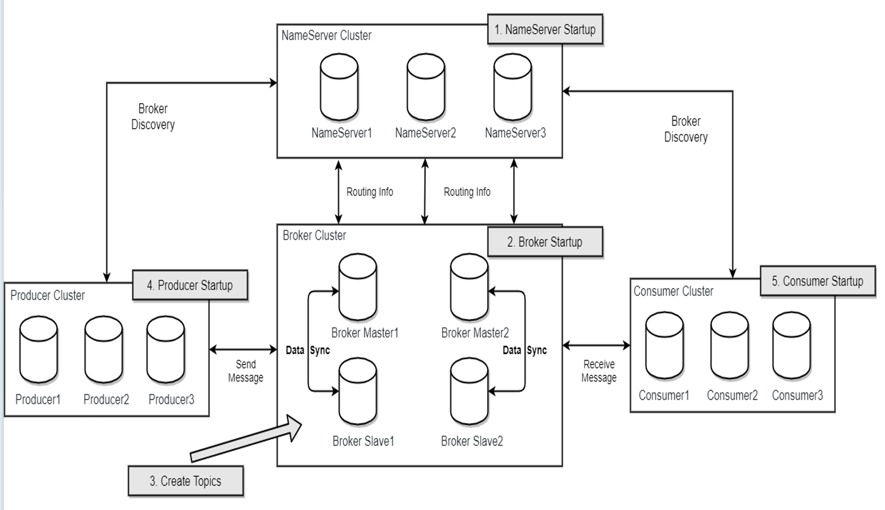
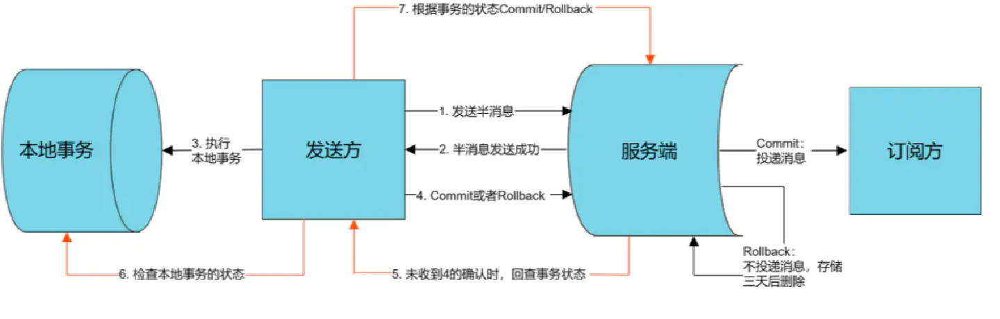
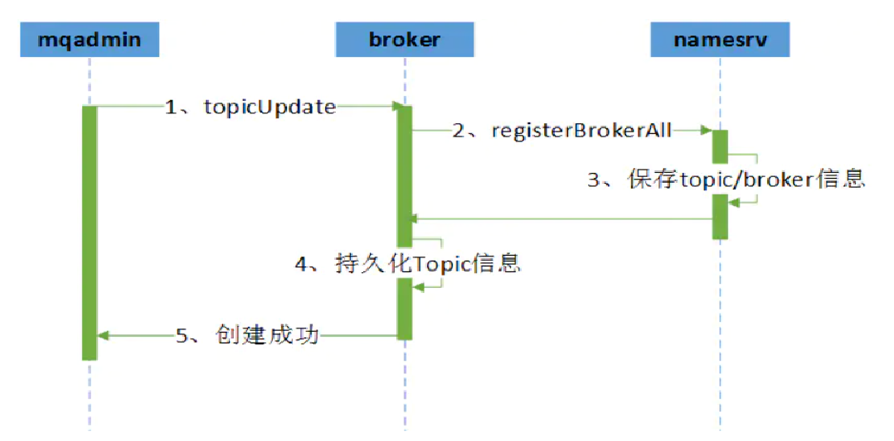

# rocketMq 基本原理

* NameServer
    * Topic Queue路由配置
    * Broker配置信息
* Broker
  * 接收存储消息
* Producer
  * 生产消息
* Consumer
  * 消费消息

# rocketMq的消息存储

## 存储模型是什么？有哪些存储类型？

RocketMQ使用了一种基于日志的存储方式，将消息以顺序写入的方式追加到文件中，从而实现高性能的消息存储和读取。

RocketMQ的消息存储方式可以分为两个类型：CommitLog 和ConsumeQueue。还有一个文件类型是indexfile，主要用于控制台消息检索，不影响消息的写入与消费

* CommitLog

    * CommitLog文件存储了Producer端写入的消息主体内容，它以追加写入的方式将消息存储到磁盘上的文件中。

    * 单个文件大小默认1G ，文件名长度为20位（左边补零，剩余为起始偏移量），当文件满了，写入下一个文件。

    * 它的主要特点是：顺序写，但是随机读（被ConsumeQueue读取）。

    * 虽然是随机读，但是利用package机制，可以批量地从磁盘读取，作为cache存到内存中，加速后续的读取速度。

    * Broker单个实例下所有的队列共用一个日志数据文件CommitLog来存储。而Kafka采用的是独立型的存储结构，每个队列一个文件。

* ConsumeQueue

    * ConsumeQueue文件是用于支持消息消费的存储结构。保存了指定Topic下的队列消息在CommitLog中的起始物理偏移量offset，消息大小size和消息Tag的HashCode值。

    * 消费者 通过 顺序读取 ConsumeQueue文件，可以快速定位到消息在CommitLog中的物理存储位置，从而实现快速消息的拉取和消费。

    * 从实际物理存储的角度来看，每个主题Topic下的每个队列Queue对应一个ConsumeQueue文件。

## 如何处理消息的过期和删除？

* RocketMQ 使用存储时长作为消息存储的依据，即每个节点对外承诺消息的存储时长。在存储时长范围内的消息都会被保留，无论消息是否被消费；超过时长限制的消息则会被清理掉。

* 需要注意的是，在RocketMQ中，消息存储时长并不能完整控制消息的实际保存时间。 因为消息存储仍然使用本地磁盘，本地磁盘空间不足时，为保证服务稳定性消息仍然会被强制清理，导致消息的实际保存时长小于设置的保存时长。

## 怎么提高存储写入性能？

1. 零拷贝技术
   
* RocketMQ通过使用内存映射文件（包括CommitLog、 ConsumeQueue等文件）来提高IO访问性能，也就是我们常说的零拷贝技术。

* Java在NIO包里，引入了sendFile（FileChannel类）和MMAP（MappedByteBuffer类）两种实现方式的零拷贝技术。

主流的MQ都会使用零拷贝技术，来提升IO：

* Kafka：record 的读和写都是基于 FileChannel。index 的读写则基于 MMAP。
* RocketMQ：读取数据基于 MMAP，写入数据默认使用 MMAP。但可以通过修改配置transientStorePoolEnable参数将其配置为使用 FileChannel。作者之所以这样设计，是为了避免 PageCache 的锁竞争，并通过两层架构实现读写分离。

2. 缓冲池写入增强

在不开启RocketMQ的内存映射增强方案时，RocketMQ的读和写都只会简单直接使用MMAP。

但是，MappedByteBuffer也存在一些缺陷：
    
* 使用虚拟内存，超过物理内存会导致内存交换，引起磁盘IO（可能非顺序IO）速度较慢。
* 虚拟内存交换是受操作系统控制的，所以其他进程活动也会触发RocketMQ内存映射的交换。

文件内存映射写入PageCache时存在锁竞争，直接写入内存可避免竞争，在异步刷盘场景下速度更快。

# rocketMq的消息的可靠性
  RocketMQ支持异步/同步刷盘以及异步/同步复制，这增加了数据的可靠性。RocketMQ新增了同步刷盘机制，保证了可靠性，不会因为操作系统Crash而导致数据丢失。

# rocketMq的延时队列怎么做的
1. 每个时间延时维护一个队列
2. 时间轮控制延迟时间

# rocketMq的消息有序
  1、kafka可保证同一个partition上的消息有序,但一旦broker宕机,就会产生消息乱序。
  2、Rocket支持严格的消息顺序,一台broker宕机,发送消息会失败,但不会乱序。举例:MySQL的二进制日志分发需要保证严格的顺序。

概括:kafka不保证消息有序,RocketMQ可保证严格的消息顺序,即使单台Broker宕机,仅会造成消息发送失败,但不会消息乱序。

# rocketMq的事务消息
二阶段提交实现事务消息

# rocketMq NameServer是怎么工作的，好处

集群下通过nameserver获取所有的broker的master地址，然后通知每个broker去创建topic

# 为什么用rocketMq，不用kafka

RocketMQ相比kafka的优势
1. 保证消息不丢(数据可靠性达10个9)
2. 可严格保证消息有序
   * kafka可保证同一个partition上的消息有序,但一旦broker宕机,就会产生消息乱序。
   * Rocket支持严格的消息顺序,一台broker宕机,发送消息会失败,但不会乱序。举例:MySQL的二进制日志分发需要保证严格的顺序。
     

如果一个Broker掉线，那么此时队列总数是否会发化?

如果发生变化，那么同一个 ShardingKey 的消息就会发送到不同的队列上，造成乱序。

如果不发生变化，那消息将会发送到掉线Broker的队列上，必然是失败的。

因此 Apache RocketMQ 提供了两种模式，如果要保证严格顺序而不是可用性，创建 Topic 是要指定 -o 参数（--order）为true，表示顺序消息:

一句话概括:kafka不保证消息有序,RocketMQ可保证严格的消息顺序,即使单台Broker宕机,仅会造成消息发送失败,但不会消息乱序。

3. 支持分布式事务消息
4. 支持按时间做消息回溯(可精确到毫秒级)
    * kafka可按照消息的offset来回溯消息
    * RocketMQ支持按照时间来回溯消息,精度到毫秒,例如从一天的几点几分几秒几毫秒来重新消费消息。

总结:RocketMQ按时间做回溯消息的典型应用场景为,consumeer做订单分析,但是由于程序逻辑或依赖的系统发生故障等原因,导致今天处理的消息全部无效,需要从昨天的零点重新处理。

5. 支持按标识和内容查询消息,用于排查丢消息
   * rocketMq 支持按标识和内容查询消息,用于排查丢消息
6. 支持消费失败重试
   * kafka不支持消费失败重试。
   * RocketMQ消费失败支持定时重试,每次重试间隔时间顺延。

7. 可支持更多的partition,即更多的消费线程数
   * kafka单机若超过了64个partition/队列,CPUload会发生明显飙高,partition越多,CPUload越高,发消息的响应时间变长。
   * RocketMQ单机支持最高5万个队列,CPUload不会发生明显显变化。

队列多有什么好处呢?
1、单机可以创建更多个topic,因为每个topic都是有一组队列组成。
2、消费者的集群规模和队列数成正比,队列越多,消费类集群可以越大。

一句话概括:RocketMQ支持的队列数远高于kafka支持的partition数致,这样RocketMQ可以支持更多的consumer集群。

# rocketMq的优秀实践
* 消息丢失
    * Producer同步发送，重试（默认三次）
    * Broker 同步刷盘，同步复制
    * Consumer 完全消费正确后再手动ACK

* 重复消费
  * 引起原因：批量消费及网络问题导致ACK
  * 解决办法：消费幂等

* 消息堆积
  * 临时新建Topic,增加queue数量，消息搬运，消费
  * 未消费消息不会超时删除

* 高吞吐量下消费优化
  * 同一group下，多机部署；并行消费 单个Consumer提高消费线程个数；批量消费

