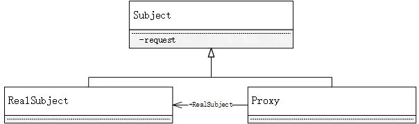

## 代理模式
代理模式：代理模式又叫委托模式，是为某个对象提供一个代理对象，并且由代理对象控制对原对象的访问。代理模式通俗来讲就是我们生活中常见的中介。
代理模式可以提供非常好的访问控制，应用比较广泛。

1. Subject
    * 抽象主题角色：可以是抽象类，也可以是接口。抽象主题是一个普通的业务类型，无特殊要求。
2. RealSubject
    * 具体主题角色：也叫做被委托角色或被代理角色，是业务逻辑的具体执行者。
3. Proxy
    * 代理主题角色：也叫做委托类或代理类。它负责对真实角色的应用，把所有抽象主题类定义的方法限制委托给真实主题角色实现，并且在具体主题角色处理完毕前后做预处理和善后处理工作。

代理模式的好处：
1. 可以使真实角色操作更加纯粹，不用关注公共的业务
2. 公共业务交给代理角色，实现了业务的分工
3. 公共业务发送扩展时，方便集中管理.

静态代理缺点：
* 一个真实角色就会产生一个代理角色，代码工作量加大.

### 动态代理
* 动态代理和静态代理角色相同
* 动态代理的代理类是动态生产的，不是直接写好的。
* 动态代理分为两大类：基于接口的动态代理，基于类的动态代理
    * 基于接口：jdk 动态代理
    * 基于类： cglib
    * java字节码实现： javasist

